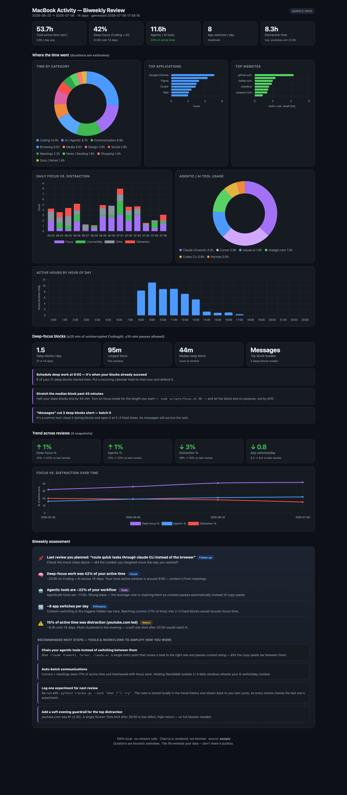

# mac-activity-tracker

**A 100% local macOS activity tracker — reads native Screen Time, browser, and CLI logs to give you a private biweekly productivity review. No cloud, no telemetry, no always-on process.**


It answers: *Where does my Mac time actually go? How much of it is deep focus vs. distraction? How much am I leaning on agentic tools (Claude, Codex, Hermes…), and what tools or workflow changes would amplify how I work?* — then re-assesses every two weeks.

> **Preview it now with zero setup:** open [`dashboard.sample.html`](dashboard.sample.html) — it's built from synthetic sample data, so the whole UI works before you touch your own data.



## What it tells you (and what to do with it)

Every run answers five questions, each tied to an action:

| The dashboard shows | The question it answers | What you can do about it |
|---|---|---|
| **Deep-focus %** (Coding + AI time) | Am I spending my best hours on real work? | Protect your peak hour (shown in the assessment) from meetings. |
| **Agentic-tool share** and per-tool split | How much am I actually leveraging AI tools — and which ones? | Consolidate on the tools that carry weight; chain them instead of copy-pasting between them. |
| **App switches / day** | How fragmented is my attention? | Batch comms into 2–3 fixed windows; the number drops within one cycle. |
| **Distraction time** + top offender | Where do the leaks cluster? | One targeted Screen Time limit beats a blanket blocker. |
| **Active hours by hour-of-day** | When am I genuinely on? | Schedule deep work inside that window, admin outside it. |

The **biweekly assessment** turns these into 3–4 concrete recommendations. The
loop that makes it useful: run it → pick **one** recommendation → change one
habit → re-run in two weeks → compare. The tool's job is done when a number you
targeted moves in the direction you wanted.

## Who this is for

- **Privacy-conscious knowledge workers** (developers, researchers, writers) who want quantified-self insight but won't send their browsing/app history to a cloud service.
- **Heavy AI / agentic-tool users** who want to see and optimize how Claude, Codex, Hermes, Cursor, etc. fit into their day.
- **Freelancers and solo operators** self-managing focus and effectiveness, with no manager and no corporate monitoring.
- **Local-first / quantified-self tinkerers** who want a small, auditable, dependency-free tool they can read and modify — not an opaque SaaS.

## Who this is *not* for

- **Managers or teams wanting to monitor other people.** This is a single-user, on-device tool with no central reporting or sync. Installing it on someone else's machine to surveil them is out of scope and against its spirit.
- **Anyone needing stopwatch-accurate or billable-hours tracking.** Durations are directional estimates (see *A note on accuracy*), not an invoicing time clock.
- **Windows or Linux users.** It reads macOS-specific data (Screen Time, macOS browser paths); it is macOS-only by design.
- **People who want a zero-terminal GUI app.** Setup is a couple of command-line steps and a Full Disk Access grant. There's no installer or menu-bar app (yet).
- **Teams wanting shared cloud dashboards.** There is intentionally no server, account, or sync — that's the point.

## Why you can trust it

- **Auditable** — a few hundred lines of dependency-free Python. Read [`tracker.py`](tracker.py) end to end in a few minutes.
- **No network egress** — grep the source: no HTTP clients, sockets, or uploads. Chart.js is **vendored locally** (`vendor/`), not fetched from a CDN, so the dashboard is fully offline.
- **Read-only** — source databases are opened read-only (or via a private, auto-deleted temp copy). Originals are never modified.
- **No daemon** — runs on demand, or on a `launchd` timer *you* control. There is no always-on process and no screen recording.
- **Private by default** — only **domains** are stored (never full URLs or page titles); a `--redact` mode drops names entirely.

## Privacy & Data

This tool runs entirely on your machine. **No telemetry, no analytics, no network requests.**

### What is read, and where it goes

| Source | What's read | How | Where it goes |
|---|---|---|---|
| Screen Time (`knowledgeC.db`) | Per-app foreground time | Read-only | `my_activity_data.json` (local) |
| Browser history (Chrome / Arc / Safari) | Visited **domains** + visit times | Read-only | `my_activity_data.json` (local) |
| Shell history (`.zsh_history` / `.bash_history`) | **Only** invocations of agentic CLIs (e.g. `claude`, `codex`); arguments are ignored | Read-only | `my_activity_data.json` (local) |

- Output files (`my_activity_data.json`, `dashboard.html`) stay in the repo folder and are **git-ignored** so you can't accidentally publish them.
- The generated `dashboard.html` **embeds your data** — treat it like a private document; don't share it.

> **Disclaimer:** Provided "as is" without warranty (see [LICENSE](LICENSE)). It reads personal activity data on your Mac; you are responsible for how you store and share what it produces.

## Requirements

macOS 12+ and Python 3.9+ (both preinstalled on modern Macs). No pip packages required to run.

## Quickstart

**Easiest** — one line, shows you the sample dashboard first, then walks you through setup:

```bash
curl -fsSL https://raw.githubusercontent.com/sgk-ctrl/mac-activity-tracker/main/scripts/install.sh | bash
```

(Read [`scripts/install.sh`](scripts/install.sh) first if you like — it clones this repo, builds the sample, and prints instructions. No sudo, nothing leaves your machine.)

**Manual** — same thing by hand:

```bash
git clone https://github.com/sgk-ctrl/mac-activity-tracker.git
cd mac-activity-tracker

# 1) See the sample dashboard (no setup, no real data)
python3 build_dashboard.py --data sample/sample_data.json --out dashboard.sample.html
open dashboard.sample.html

# 2) Switch to YOUR data (needs Full Disk Access — see below)
python3 tracker.py                                   # -> my_activity_data.json
python3 build_dashboard.py --data my_activity_data.json
open dashboard.html
```

Or just: `make review`.

## Install as a Mac app

Prefer double-clicking to typing? Build the launcher app (uses `osacompile`,
which ships with macOS — no Xcode, no downloads):

```bash
make app        # builds "Activity Review.app" into ~/Applications
```

The app is a plain AppleScript applet — read
[`packaging/applet.applescript.tmpl`](packaging/applet.applescript.tmpl) to
audit everything it can do. Double-click it for a menu:

- **Run biweekly review** — collect, build, and open your dashboard
- **Run review + log an experiment note** — same, plus the note your next review will check
- **Focus mode: 60 min / off** — block your distraction sites (asks for your password — it edits `/etc/hosts`)
- **Preview focus blocklist** — see what would be blocked

**Best part:** grant Full Disk Access to *the app* instead of your terminal —
a much narrower grant (System Settings ▸ Privacy & Security ▸ Full Disk Access
▸ + ▸ `~/Applications/Activity Review.app`). It launches, does one thing, and
quits — still no always-on process. Rebuild with `make app` if you move the
repo folder.

### Granting Full Disk Access

Reading the Screen Time and browser databases requires **Full Disk Access** for the terminal you run this from:

**System Settings ▸ Privacy & Security ▸ Full Disk Access** → add Terminal (or iTerm).

⚠️ This is a broad, persistent grant: it lets *anything* run in that terminal read sensitive files. Consider granting it to a dedicated terminal profile and **revoking it after your run**. Without it, app-usage and browser history are skipped (you'll get a clear warning) and the rest still works.

## Collection options

```bash
python3 tracker.py --days 14        # lookback window (default 14)
python3 tracker.py --no-browser     # app usage + CLI only
python3 tracker.py --no-shell       # skip shell history
python3 tracker.py --redact         # category + time only; drop all names
```

## Deep-focus blocks & Focus mode

The dashboard's **Deep-focus blocks** section measures your uninterrupted runs
of Coding/AI work (≥25 min, short pauses allowed): blocks per day, longest,
median, and — most usefully — **which app or site cuts your blocks short**.
Suggestions adapt to your data: comms tools get a "batch it" plan, distraction
sites get focus mode.

**Focus mode** blocks your personal distraction sites system-wide while you
work — the blocklist comes from *your own* tracked distraction domains, plus
the usual suspects:

```bash
scripts/focus.sh list          # preview what would be blocked (no sudo)
sudo scripts/focus.sh 60       # block for 60 min, auto-restores after
sudo scripts/focus.sh on       # block until further notice
sudo scripts/focus.sh off      # restore immediately
```

Honesty notes: this is the **only** part of the toolkit that writes outside the
repo folder — it adds a clearly-marked section to `/etc/hosts` (hence `sudo`)
and `off` removes exactly that section. It's a speed bump you control, not a
parental control; already-open tabs may keep working until reloaded.

## Trends across reviews (the part that changes habits)

Every collection run also writes an **aggregate-only snapshot** to `history/`
(category totals and KPIs — never app, site, or command names; git-ignored like
everything else of yours). Once two snapshots exist, the dashboard adds a
**Trend across reviews** section: delta chips for deep-focus %, agentic %,
distraction %, and app switches/day, plus a line chart over time.

Log an experiment with each run:

```bash
python3 tracker.py --note "batch Slack into two windows"
```

The note is stored locally in the snapshot and shown back to you at the top of
your **next** review — so every review starts by checking whether the last
experiment worked. Skip snapshots entirely with `--no-history`.

## Customizing categories

Edit [`categories.py`](categories.py) — plain data mapping apps/domains to categories and marking what counts as focus, distraction, or agentic. PRs adding common apps welcome.

## Automating the biweekly review

```bash
FOLDER="$(pwd)"
LABEL="com.$(whoami).activityreview"
sed -e "s|__PATH__|$FOLDER|g" -e "s|__LABEL__|$LABEL|g" \
    packaging/com.example.activityreview.plist > ~/Library/LaunchAgents/$LABEL.plist
launchctl load ~/Library/LaunchAgents/$LABEL.plist
```

It rebuilds the dashboard every ~14 days and logs to `review.log`. Cadence is approximate (a job due while the Mac is asleep runs on wake). Prefer a fixed rhythm? Use [`packaging/com.example.activityreview.calendar.plist`](packaging/com.example.activityreview.calendar.plist) instead — it runs on the **1st and 15th at 09:00** (same install one-liner, pointed at that file).

**Uninstall:** `launchctl unload ~/Library/LaunchAgents/$LABEL.plist && rm ~/Library/LaunchAgents/$LABEL.plist`, then delete `my_activity_data.json`, `dashboard.html`, and `review.log`.

## How it works

`tracker.py` reads three native sources into a single JSON schema →
`build_dashboard.py` renders that JSON into a self-contained HTML dashboard
(data embedded as inert JSON, Chart.js from `vendor/`). The dashboard computes
KPIs (focus %, agentic-tool share, context-switches/day, distraction time),
several charts, and a rule-based biweekly assessment with tool/workflow suggestions.

## A note on accuracy

Durations are **estimates**. App usage comes from Screen Time (which may only
retain recent days and can be disabled); overlapping Screen Time rows are
de-overlapped so a day can never sum past 24h. Web "time" groups visits from
**all** browsers into one timeline, splits it into browsing sessions at 15-minute
idle gaps, and credits each visit the (capped) gap to the next — a proxy, not a
true focus signal. CLI durations use the real elapsed time your shell recorded
(zsh `EXTENDED_HISTORY`); entries without one get a small nominal credit. Treat
the numbers as **directional trends**, not stopwatch-accurate.

## Contributing / Security / License

- [CONTRIBUTING.md](CONTRIBUTING.md) · [CODE_OF_CONDUCT.md](CODE_OF_CONDUCT.md)
- Found a vulnerability? See [SECURITY.md](SECURITY.md) (please report privately).
- Full data-handling detail: [PRIVACY.md](PRIVACY.md)
- Scope & success criteria: [DEFINITION_OF_DONE.md](DEFINITION_OF_DONE.md)
- Licensed under [MIT](LICENSE). Bundles Chart.js (MIT) in `vendor/`.
